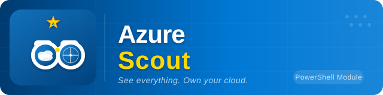

# AzureScout



*See everything. Own your cloud.*

## Overview

**AzureScout** (AZSC) is a PowerShell module that discovers and inventories everything in your Azure environment — ARM resources, Entra ID objects, costs, security posture, policies, and more. Reports are generated as Excel workbooks, JSON, Markdown, or AsciiDoc.

::: tip Inventory vs Assessment — two tools, one module
AzureScout is **one command**, `Invoke-AzureScout`, with two modes. By default it builds a wide **inventory** of everything in your tenant; add `-Assessment` and it runs a scored **CAF/WAF assessment**. Run it with no parameters at all and it opens a guided wizard. Start with the [Overview](./guide/overview.md).
:::

| Feature | Description |
|---------|-------------|
| **ARM Resource Discovery** | 240 collector definitions across 18 Microsoft Azure categories (AI + machine learning, Analytics, Compute, Containers, Databases, DevOps, General, Hybrid + multicloud, Identity, Integration, IoT, Management and governance, Migration, Monitor, Networking, Security, Storage, Web) |
| **Entra ID Inventory** | 17 identity modules — Users, Groups, Applications, Service Principals, Conditional Access, PIM, Administrative Units, Named Locations, Domains, Identity Providers, Security Defaults, and more |
| **Excel Reports** | Rich multi-worksheet workbooks with charts, pivot tables, and conditional formatting |
| **JSON Output** | Machine-readable normalized output for automation pipelines |
| **Markdown & AsciiDoc** | Export reports as `.md` or `.adoc` for documentation pipelines and PDF generation |
| **Network Diagrams** | Auto-generated draw.io topology diagrams |
| **Category Filtering** | Run only the categories you need: `-Category Compute,Security,Networking` |
| **Permission Audit** | Pre-flight ARM + Graph access checker with role remediation guidance |

### Quick Start

```powershell
# Install from PSGallery
Install-Module -Name AzureScout

# Import from local clone
Import-Module ./AzureScout.psd1

# Full discovery (ARM only, uses current Azure context)
Invoke-AzureScout

# ARM + Entra ID
Invoke-AzureScout -Scope All

# ARM-only scan with JSON output
Invoke-AzureScout -Scope ArmOnly -OutputFormat Json

# Specific categories only
Invoke-AzureScout -Category Compute,Security,Networking

# Permission pre-flight check
Invoke-AzureScout -PermissionAudit
```

::: tip
If you're already logged in via `Connect-AzAccount`, AzureScout uses your existing session — no additional flags needed.
:::

## Documentation

| Page | Description |
|------|-------------|
| [Overview](./guide/overview.md) | One command, two modes — the wizard, the switches, and which mode you need |
| [Authentication](./guide/authentication.md) | Five authentication methods (interactive, device-code, SPN+secret, SPN+cert, managed identity) |
| [Usage Guide](./guide/usage.md) | Scope, OutputFormat, Category filtering, and examples |
| [Permissions](./guide/permissions.md) | Required ARM RBAC roles and Microsoft Graph API permissions |
| [Category Filtering](./guide/category-filtering.md) | Run targeted scans using Microsoft's 15 Azure categories |
| [Category Reference](./reference/category-reference.md) | Every report section heading mapped to its category, aliases, and collector folder |
| [Azure Automation Account](./automation-guide/automation.md) | Scheduled unattended runs from a runbook, writing to blob storage |
| [GitHub Actions](./automation-guide/github-actions.md) | Generate inventory from a CI pipeline with the composite action |
| [Azure DevOps](./automation-guide/azure-devops.md) | Inventory projects, pipelines, service connections, repos, and agent pools |
| [ARM Modules](./reference/arm-modules.md) | 240 collector definitions across all 18 Azure service categories |
| [Entra Modules](./reference/entra-modules.md) | 17 Entra ID identity modules |
| [Validation Matrix](./reference/validation-matrix.md) | Per-check automated vs live-tenant verification coverage |
| [Repository Structure](./project/folder-structure.md) | Directory layout and module loading |
| [Contributing](./project/contributing.md) | How to add new inventory modules |
| [Credits](./project/credits.md) | Attribution and acknowledgments |
| [Changelog](./project/changelog.md) | Version history |
| [Assessment Platform](./assessment/assessment.md) | CAF/WAF landing-zone assessment — architecture, run modes, and the assessment registry |
| [Assessment Prerequisites](./assessment/assessment-prerequisites.md) | Software, module, and .NET SDK prerequisites specific to assessment mode (`-Assessment`) |
| [Assessment Permissions](./assessment/assessment-permissions.md) | Minimum RBAC and Graph permissions per assessment, and `-PermissionAudit` |
